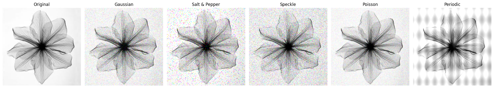
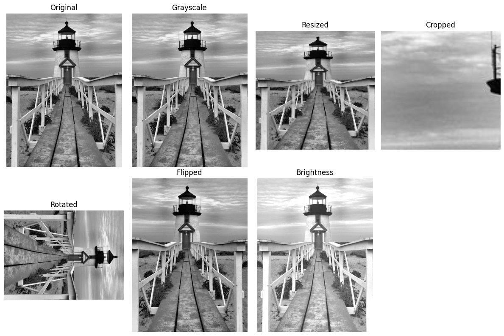
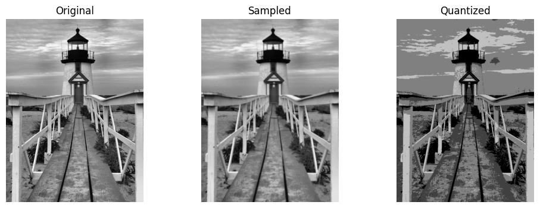
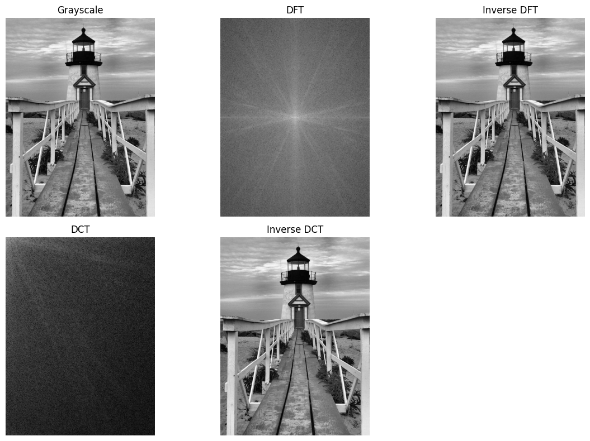

# Image Processing Lab

This repo was created to keep track of all the lab assignments of Image Processing Subject

## Lab-0
### Using Different Filters in a photo
##### Filters Used:
- Gaussian Filter
- Salt & Pepper Filter
- Speckle Filter
- Poisson Filter
- Periodic Filter

### Output

## Lab-1
#### a. Practice Basic Image Processing Operations  
##### Operations performed:
- Resized
- Cropped
- Rotated
- Flipped
- Brightness
### Output

#### b. Demonstrate Sampling and Quantization  
### Output

#### c. Demonstrate 2D Transforms DFT,DCT 
### Output

